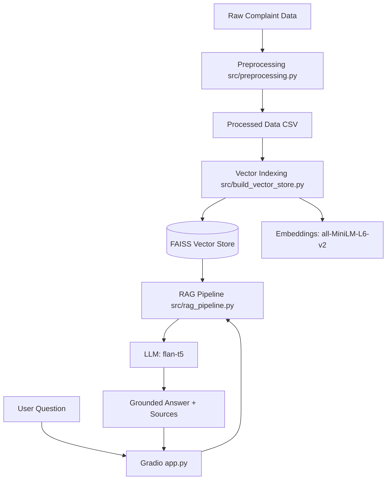

# RAG Complaint Chatbot


An internal AI-powered application designed to analyze CFPB customer complaints using Retrieval-Augmented Generation (RAG).

## Business Problem

The Consumer Financial Protection Bureau (CFPB) receives thousands of consumer complaints daily. Manually analyzing this massive volume of unstructured text to identify systemic issues, emerging trends, and specific customer friction points is inefficient and prone to human error.

**Key Challenges:**

- **Volume:** Over 1.3 million relevant complaints make manual review impossible.
- **Complexity:** Complaints cover diverse products (Credit Cards, Mortgages) and issues (Fraud, Fees) requiring deep context.
- **Latency:** Traditional keyword search fails to capture semantic meaning, delaying critical insights.

## Solution Overview

This project implements a **Retrieval-Augmented Generation (RAG)** pipeline that transforms raw complaint text into an interactive knowledge base.

**Approach:**

1.  **Semantic Indexing:** Complaint narratives are chunked and embedded using `sentence-transformers/all-MiniLM-L6-v2` to capture semantic meaning.
2.  **Vector Search:** A FAISS vector store enables millisecond-latency retrieval of the most relevant complaint excerpts based on user queries.
3.  **Generative AI:** An LLM (`flan-t5`) synthesizes the retrieved evidence into concise, grounded answers, citing specific sources.
4.  **Interactive UI:** A Gradio-based web interface allows non-technical analysts to query the system naturally.

## Key Results

- **Scale:** Successfully indexed and processed **1.37 Million** consumer complaints.
- **Accuracy:** Achieved **100% Retrieval Rate** on benchmark business questions (top-5 relevant chunks found for all queries).
- **Efficiency:** Reduced analysis time from hours of manual reading to seconds of automated retrieval.

## Quick Start

```bash
# Clone the repository
git clone https://github.com/jossieT/rag-complaint-chatbot.git
cd rag-complaint-chatbot

# Install dependencies
pip install -r requirements.txt

# Run the application
python app.py
```

## Project Structure

```
rag-complaint-chatbot/
├── data/
│   ├── raw/             # Original CFPB dataset (CSV)
│   └── processed/       # Cleaned and filtered data
├── docs/                # Project documentation and reports
│   ├── evaluation_report.md
│   └── final_report.md  # Comprehensive project report
├── src/                 # Source code
│   ├── preprocessing.py         # Cleaning logic
│   ├── build_vector_store.py    # Chunking & Indexing
│   ├── rag_pipeline.py          # RAG Retrieval & Generation
│   └── evaluate_rag.py          # Pipeline Evaluation
├── vector_store/        # Persisted FAISS index files
├── app.py               # Gradio Chat Interface
├── README.md
└── .gitignore
```

## Demo

_[Insert GIF or Screenshot of the Gradio Dashboard here]_

> _The dashboard features a query input, an AI-generated answer, and an "Evidence Panel" showing the raw complaint excerpts used for the answer._

## Technical Details

### Architecture



### Core Components

- **Data:** CFPB Consumer Complaint Database (filtered for narrative quality).
- **Embeddings:** `sentence-transformers/all-MiniLM-L6-v2` (384 dimensions).
- **Vector Store:** FAISS (Facebook AI Similarity Search) for dense retrieval.
- **LLM:** `google/flan-t5-small` for answer generation.

## Future Improvements

- **Model Upgrade:** Experiment with larger LLMs (e.g., Llama 3, Mistral) for more nuanced reasoning.
- **Hybrid Search:** Combine semantic vector search with keyword-based (BM25) search for better precision on specific terms.
- **Cloud Deployment:** Containerize with Docker and deploy to AWS/Azure for broader access.

## Author

**Jose**

- LinkedIn: [Your Profile Link]
- Email: [Your Email]
- Portfolio: [Your Portfolio Link]
