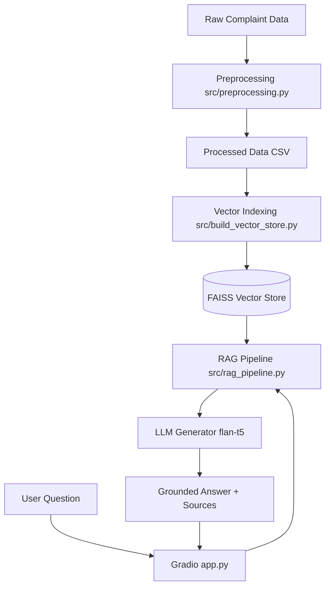

# RAG Complaint Chatbot

An internal AI-powered application designed to analyze CFPB customer complaints using Retrieval-Augmented Generation (RAG).

## 🏗️ Architecture



## 🚀 Project Overview

The project is being developed in phases:

- **Task 1**: Data Preprocessing & Cleaning.
- **Task 2**: Text Chunking, Embedding generation, and Vector Store Indexing.
- **Task 3**: Retrieval & RAG Pipeline Implementation.
- **Task 4**: Interactive Chat Interface with Gradio.

## 🛠️ Installation & Setup

### 1. Clone the repository

```bash
git clone <repository-url>
cd rag-complaint-chatbot
```

### 2. Install Dependencies

```bash
pip install pandas scikit-learn langchain-text-splitters langchain-huggingface langchain-community faiss-cpu sentence-transformers gradio transformers torch
```

**Note for Windows Users**:
If you encounter `DLL initialization routine failed` errors, reinstall `torch` using the CPU-specific bundle:

```bash
pip install torch --index-url https://download.pytorch.org/whl/cpu --force-reinstall
```

## 📂 Project Structure

```
rag-complaint-chatbot/
├── data/
│   ├── raw/             # Original CFPB dataset (CSV)
│   └── processed/       # Cleaned and filtered data
├── docs/                # Project documentation and reports
│   ├── evaluation_report.md
│   └── walkthrough.md
├── notebooks/           # Jupyter notebooks for EDA and testing
├── src/                 # Source code
│   ├── preprocessing.py         # Cleaning logic
│   ├── build_vector_store.py    # Chunking & Indexing
│   ├── rag_pipeline.py          # RAG Retrieval & Generation
│   └── evaluate_rag.py          # Pipeline Evaluation
├── vector_store/        # Persisted FAISS index files
├── app.py               # Gradio Chat Interface
├── README.md
└── .gitignore           # Configured to ignore large data files
```

## 🔄 Core Pipeline

### Phase 1: Data Preprocessing

Executes broad cleaning on the CFPB dataset.
**Run command:** `python src/process_full_dataset.py`

### Phase 2: Vector Store Indexing

Transform text into a searchable semantic index.
**Run command:** `python src/build_vector_store.py`

### Phase 3: RAG Core & Evaluation

Builds the retrieval-augmented generation logic and evaluates it.
**Run command:** `python src/evaluate_rag.py`

### Phase 4: Interactive Chat Interface

Launches the web UI for querying customer complaints.
**Run command:** `python app.py`

## 📝 Deliverables

- Cleaned dataset in `data/processed/`.
- Searchable vector store in `vector_store/`.
- Functional RAG pipeline in `src/rag_pipeline.py`.
- Interactive web UI in `app.py`.
- Evaluation report in `docs/evaluation_report.md`.
