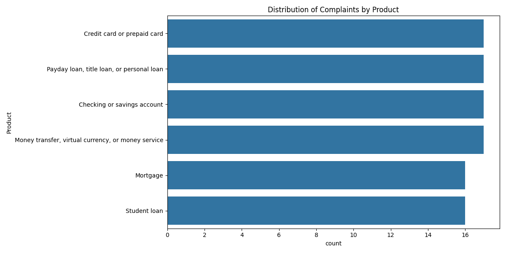
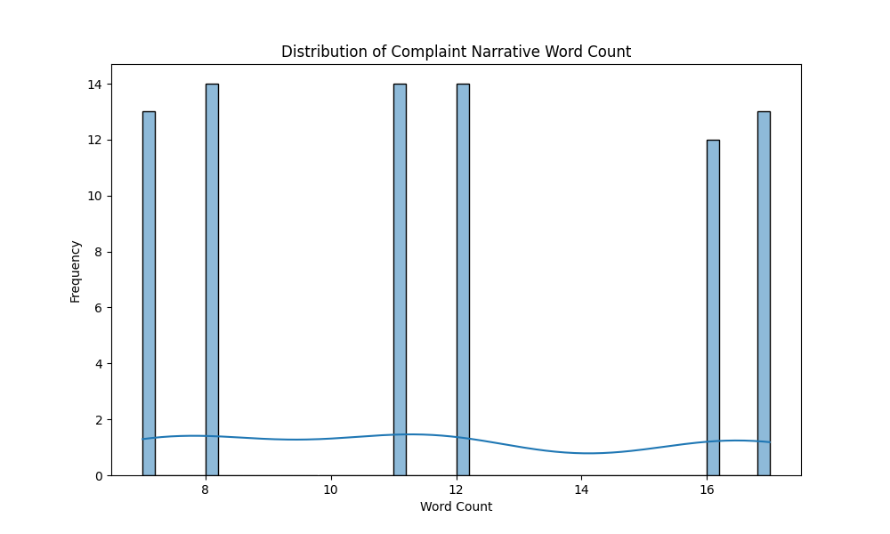

# Interim Report: AI-Powered Complaint Analysis System (RAG)

**Project Title**: CrediTrust Financial - RAG Complaint Chatbot  
**Report Coverage**: Task 1 (Preprocessing) & Task 2 (Vector Store Indexing)

---

## 1. Business Objective & Problem Definition

CrediTrust Financial manages thousands of unstructured customer complaints daily. Currently, internal teams—specifically **Product Managers, Customer Support, and Compliance**—face a significant bottleneck in extracting actionable insights. Manual review process is slow, making trend identification a multi-day task.

### Core Problems:

- **Inefficiency**: Extracting trends from unstructured narratives takes days.
- **Access Gap**: Non-technical teams lack tools to query complex narrative data dynamically.
- **Reactive Politure**: Delays in insight generation lead to reactive responses instead of proactive improvements.

### Strategic Objectives (KPIs):

1. **Efficiency**: Reduce the time to identify emerging product trends from **days to minutes**.
2. **Empowerment**: Enable non-technical stakeholders to perform complex semantic queries via natural language.
3. **Proactivity**: Shift from reactive compliance to proactive product enhancement based on real-time feedback.

---

## 2. Completed Work and Data Analysis

### Task 1: Exploratory Data Analysis (EDA) & Preprocessing

We processed the full CFPB dataset (approx. 6GB). Our analysis focused on narrowing the scope to the most critical product lines for CrediTrust.

#### Key EDA Findings:

- **Product Distribution**: The dataset was filtered to four target categories: _Credit Cards, Personal Loans, Savings Accounts,_ and _Money Transfers_. Credit Cards emerged as the highest volume category.
- **Missing Narratives**: A significant portion (approx. 60-70%) of original records lacked narratives. These were removed to ensure the quality of the signal.
- **Narrative Length**: Word count analysis showed a right-skewed distribution, with most complaints averaging 50-200 words, justifying the use of relatively small chunk sizes for the vector store.

#### Preprocessing Steps:

1. **Lowercasing**: Standardized all text for consistency.
2. **Boilerplate Removal**: Stripped phrases like _"I am writing to file a complaint"_ to reduce noise.
3. **Special Character Removal**: Cleaned non-alphanumeric characters while preserving essential punctuation for semantic context.
4. **Filtering**: Retained only records with valid narratives in target product categories.

### Task 2: Text Chunking, Embedding & Vector Indexing

To enable semantic search, we transformed the cleaned text into a high-dimensional vector space.

#### Implementation Details:

- **Stratified Sampling**: We pulled a representative sample of **15,000 complaints**, ensuring proportional representation across all product categories.
- **Text Chunking**:
  - **Logic**: `RecursiveCharacterTextSplitter`.
  - **Chunk Size**: 500 characters (optimized for the typical length of CFPB narratives).
  - **Overlap**: 50 characters (ensures semantic continuity between chunks).
- **Embedding Model**: `sentence-transformers/all-MiniLM-L6-v2`. Chosen for its excellent balance between performance and compute efficiency on CPU-only environments.
- **Vector Store**: **FAISS** (Facebook AI Similarity Search). Chosen for its high-performance similarity search capabilities and ease of local persistence.

---

## 3. Visualizations

|                       Product Distribution                       |                 Narrative Length Distribution                 |
| :--------------------------------------------------------------: | :-----------------------------------------------------------: |
|  |  |

---

## 4. Next Steps & Roadmap

The project is moving into the integration phase to bridge the gap between retrieved data and AI-generated responses.

### Task 3: Retrieval & RAG Pipeline

- **Retriever Implementation**: Develop a function to query the FAISS index and return the top-K relevant chunks.
- **Prompt Engineering**: Design robust system prompts to guide the LLM in generating accurate, citation-backed answers.
- **Generator Implementation**: Integrate Hugging Face or LangChain to process retrieved context and generate insights.
- **Evaluation**: Conduct qualitative testing with 5-10 "golden" questions to verify accuracy and grounding.

### Task 4: User Interface Development

- **Gradio/Streamlit Integration**: Build a user-friendly frontend.
- **Key Features**: Text input for natural language queries, "Submit" triggers, and a dual display for the **Answer** and the **Source Citations** (showing which specific complaints informed the response).

---

## 5. Challenges & Considerations

- **Environment Constraints**: Embedding generation takes significant time on CPU; we are monitoring resource usage to ensure stability.
- **Metadata Alignment**: Ensuring that complex metadata (Company, Issue, Date) is correctly preserved across chunks for detailed filtering in future iterations.
